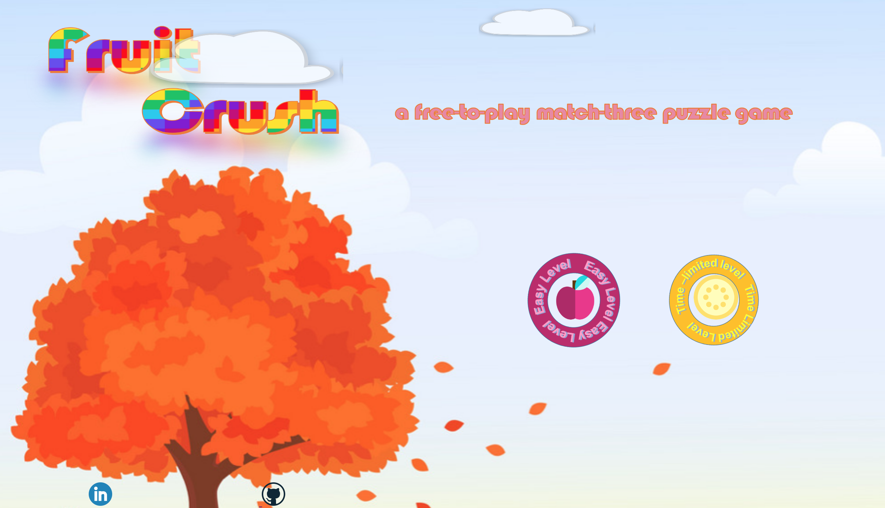
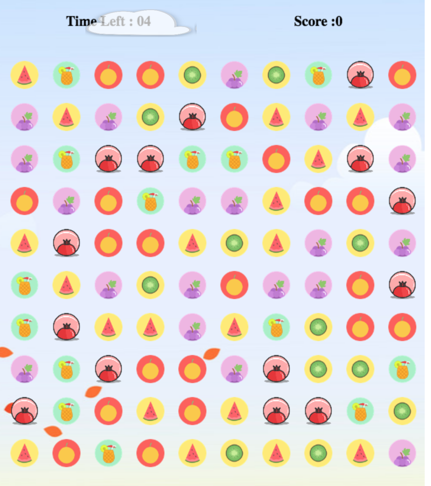
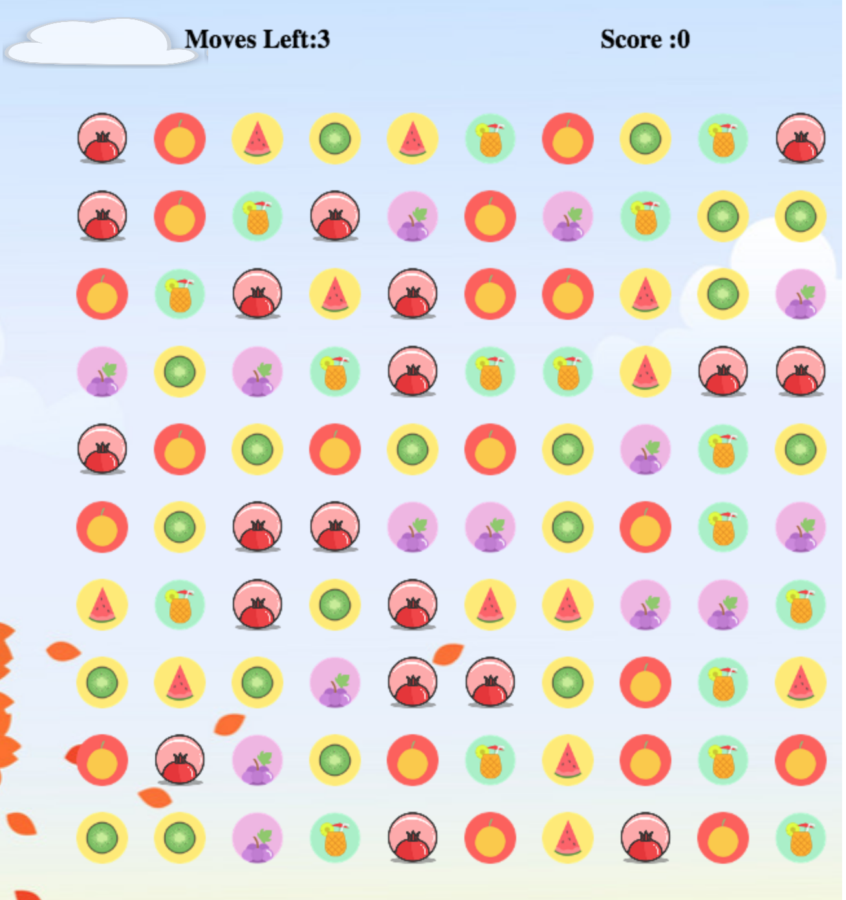

# FruitCrush
BallCrush is a candy crush inspired game in which players complete levels by swapping pieces of fruit on a game board to make a match of three or more of the same pattern, eliminating those fruit from the board and replacing them with new ones, which could potentially create further matches.

**Functionalities and MVPs**
- [ ]  Use canvas to create fruit and render them on index page
- [ ]  can switch fruit vertically, diagonally and horizontally
- [ ]  can remove fruit of same pattern
- [ ]  top fruit will fall when lower fruit is eliminated
- [ ]  can calculate score
- [ ]  bonus
        -[ ] create sound effect
        -[ ] create time-limited level

**Features**

The game index page is animated by pure CSS, such as spinning buttons and floating clouds to create a seamless UI.

The game is split into 2 levels. Each level poses a different challenge to the user, such as achieving a minimum score in a fixed amount of time or clearing fruit in a fixed number of moves to bring special ingredients to the bottom of the board.

**TimeLine**

<<<<<<< HEAD
Over the weekend: Setup all necessary Node modules, including getting webpack up and running. Create webpack.config.js as well as package.json.
=======
Over the weekend: Setup all necessary Node modules, including getting webpack up and running. Create webpack.config.js as well as package.json.
>>>>>>> ffd1b412481f85c585081e69d3ce0e549e7e8e72

- [ ] Create a webpack.config.js file
- [ ] Generate bundle.js and ensure it's working with the entry file
- [ ] Create basic visual frames
<<<<<<< HEAD

Day 1:
=======

Day 1:
>>>>>>> ffd1b412481f85c585081e69d3ce0e549e7e8e72

- [ ] Complete cavas drawing
- [ ] Start on keyboard control for swapping balls

Day 2:
- [ ] Complete balls elimation logic
- [ ] Start on animation
<<<<<<< HEAD

Day 3:
- [ ] Continue on logic
- [ ] Complete animation

Day 4:
=======

Day 3:
- [ ] Continue on logic
- [ ] Complete animation

Day 4:
>>>>>>> ffd1b412481f85c585081e69d3ce0e549e7e8e72
- [ ] polish animation
- [ ] testing
