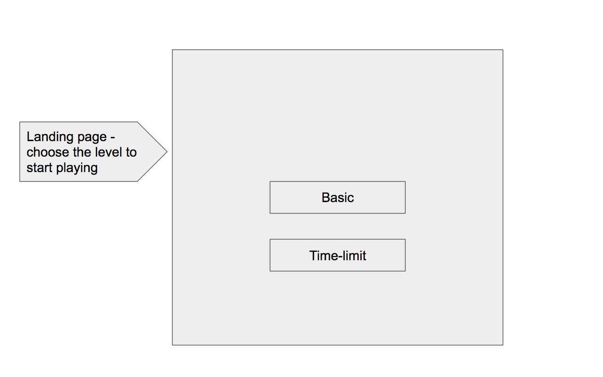
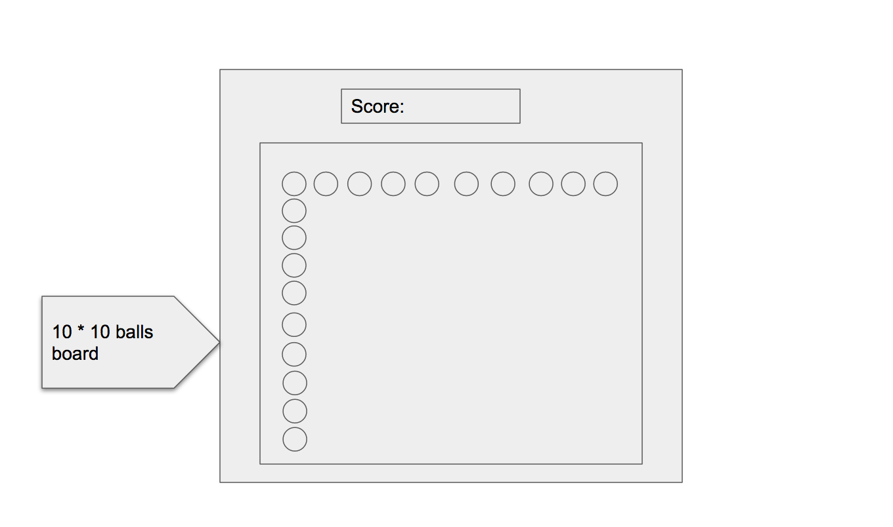

# BallCrush
BallCrush is a candyCrush-inspired game in which players complete levels by swapping coloured pieces of balls on a game board to make a match of three or more of the same color, eliminating those balls from the board and replacing them with new ones, which could potentially create further matches.

**Functionalities and MVPs**
- [ ]  Use canvas to create balls and render them on index page
- [ ]  can switch balls vertically, diagonally and horizontally
- [ ]  can remove balls of same color
- [ ]  top balls will fall when lower balls are eliminated
- [ ]  can calculate score
- [ ]  bonus
    -[ ] create sound effect
    -[ ] create time-limited level

**Wireframes**

