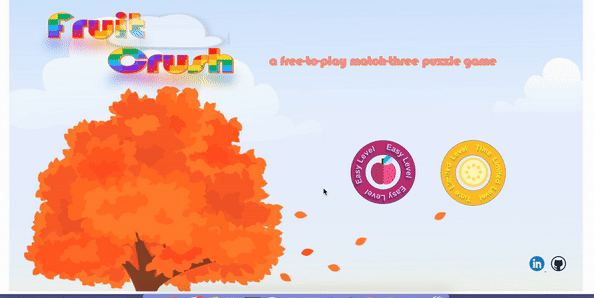
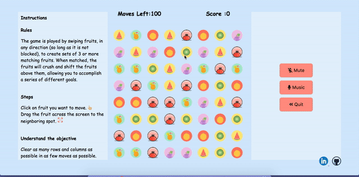

# FruitCrush

[FruitCrush Live](https://jiangtt18.github.io/FruitCrush/)

BallCrush is a candy crush inspired game in which players complete levels by swapping pieces of fruit on a game board to make a match of three or more of the same pattern, eliminating those fruit from the board and replacing them with new ones, which could potentially create further matches.

**Functionalities and MVPs**
- [ ]  Use canvas to create fruit and render them on index page
- [ ]  can switch fruit vertically, diagonally and horizontally
- [ ]  can remove fruit of same pattern
- [ ]  top fruit will fall when lower fruit is eliminated
- [ ]  can calculate score
- [ ]  create sound effect
- [ ]  create time-limited level

**Features**

The game index page is animated by pure CSS, such as spinning buttons and floating clouds to create a seamless UI.The game is split into 2 levels. Each level poses a different challenge to the user, such as achieving a minimum score in a fixed amount of time or clearing fruit in a fixed number of moves to bring special ingredients to the bottom of the board.

Customized javascript Algorithm to enable a smooth fall animation.
